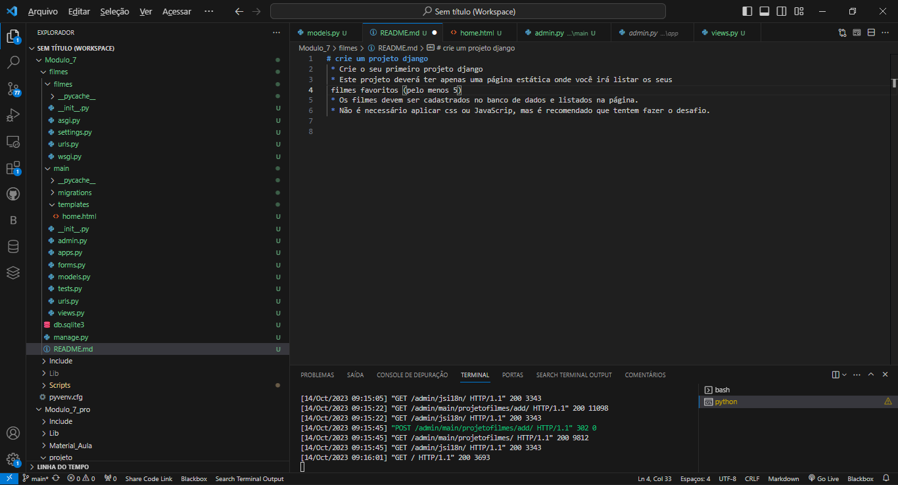
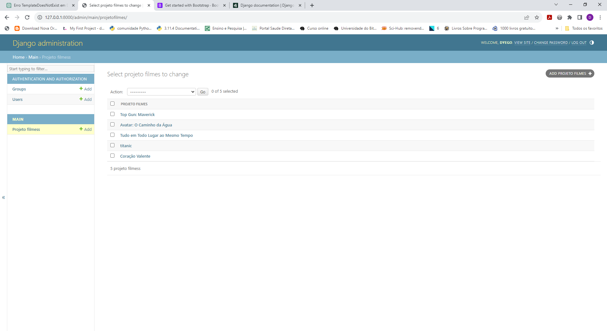

# crie um projeto django
 * Crie o seu primeiro projeto django
 * Este projeto deverá ter apenas uma página estática onde você irá listar os seus
 filmes favoritos (pelo menos 5)
 
 * Os filmes devem ser cadastrados no banco de dados e listados na página.
 
 * Não é necessário aplicar css ou JavaScrip, mas é recomendado que tentem fazer o desafio.

